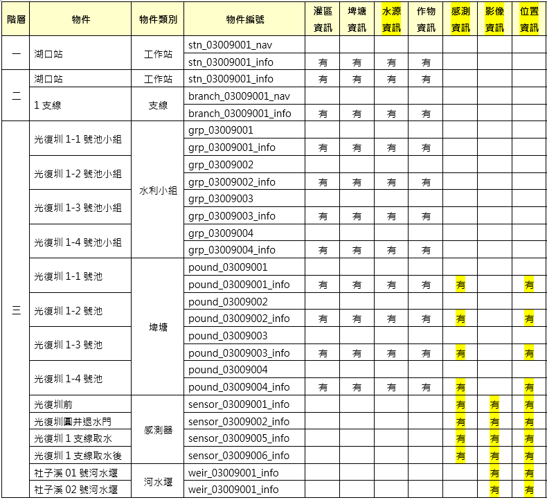
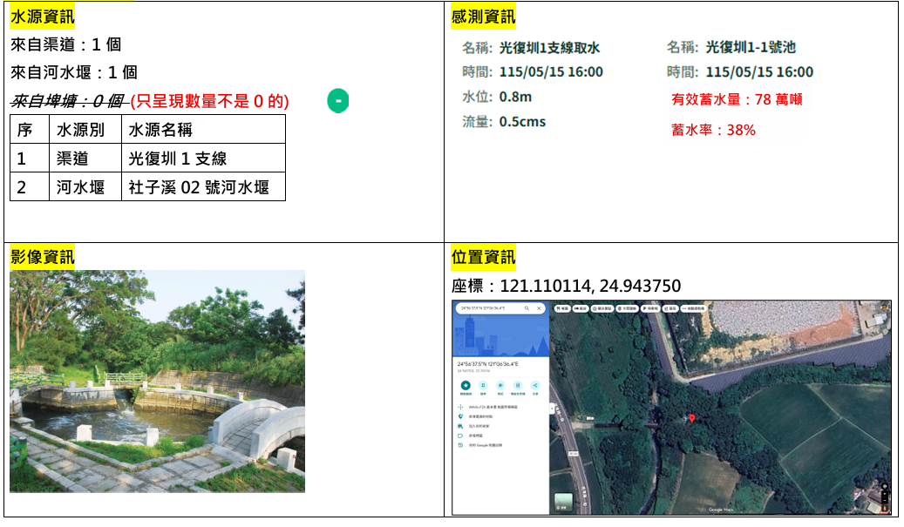

需求說明
    1.彈窗之後會有多種分類頁籤類別有[灌區資訊、埤塘資訊、水源資訊、作物資訊、感測資訊、影像資訊、位置資訊]，根據不同的資料類別去決定要顯示哪些頁籤 類別關係如圖
    我的資料mock api該怎麼處理 跟我的彈窗componet 該怎麼設計
    2.我的api設計 是不是應該把不同類型的類別資料拆開 例如payload {type:grp,id:03009001} ,這樣設計 會不會比較接近之後真實api的情境

理解
    1. 之後詳細資料彈窗不會只有目前的灌區/埤塘/作物三種頁籤，而是會依不同圖資或資料類別動態顯示頁籤。
       例如
       水利小組、工作站、支線 彈窗顯示「灌區資訊、埤塘資訊、水源資訊、作物資訊」；
       水位流量計 彈窗顯示「感測資訊、影像資訊、位置資訊」；
       埤塘 彈窗顯示「灌區資訊、埤塘資訊、水源資訊、作物資訊、感測資訊、位置資訊」；
       河水堰 彈窗顯示「影像資訊、位置資訊」
      
      水源資訊、感測資訊、影像資訊、位置資訊 顯示如下圖
       

    2. mock api 不應該直接回傳前端 UI 結構。
       也就是資料內不應該放 tab label、表格表頭、單位、CSS class、component 名稱等畫面邏輯。
       mock api 應該只回傳資料面內容，例如 id、type、name、area、storage、flow、location、images、sensor readings 等。

    3. 彈窗 component 應該負責根據資料 type 或 tabs key，把資料轉成畫面。
       也就是前端應該有一份固定的 tab 設定表，定義每一種頁籤的標題、欄位、單位、表格欄位、渲染元件。

    4. 新增需求說明 2 的理解：
       API 查詢 payload 拆成 type + id 是合理的，而且比較接近真實產品情境。
       例如 SVG id 是 grp_03009001_info，前端點擊後可以轉成：

        {
          "type": "grp",
          "id": "03009001"
        }

       這比直接把 grp_03009001 當作唯一查詢 id 更有彈性，因為後端通常會依資料類型查不同資料表、不同 service 或不同 domain model。
       例如：
            grp        水利小組/灌區資料
            pound      埤塘資料
            sensor     感測器資料
            weir       河水堰資料
            branch     支線/渠道資料

       前端仍可保留 SVG 命名規則，但進入 API 層前應 normalize 成標準 payload。

建議資料格式
    mock api 建議每筆資料用扁平或半結構化資料，不用直接塞 UI tabs：

        {
          id: "grp_03009001",
          type: "irrigationGroup",
          name: "光復圳1-1號池小組",
          availableTabs: ["irrigation", "pond", "crop"],
          irrigation: {
            area: 78.86,
            isDirectIrrigation: false
          },
          pond: {
            count: 1,
            maxStorage: 6.67,
            effectiveStorage: 3.78,
            storageRate: 57
          },
          crop: {
            floodedAreaDate: "115/3/5",
            recentFloodedArea: 20,
            years: ["111", "112", "113", "114", "115"],
            rows: []
          }
        }

    如果是感測器：

        {
          id: "sensor_03009001",
          type: "sensor",
          name: "渠道流量計01",
          availableTabs: ["sensor", "location"],
          sensor: {
            flow: 12.4,
            waterLevel: 0.8,
            updatedAt: "115/05/15 16:00"
          },
          location: {
            latitude: 24.9,
            longitude: 121.05
          }
        }

    如果是影像資訊：

        {
          id: "pound_03009001",
          type: "pond",
          name: "光復圳1-1號池",
          availableTabs: ["pond", "media", "location"],
          media: {
            images: [
              { title: "現地照片", url: "/mock/image.jpg" }
            ]
          },
          location: {
            latitude: 24.9,
            longitude: 121.05
          }
        }

彈窗 component 設計
    1. 建議保留一個共用 DetailDialog component。
       它只負責彈窗框架、tabs 切換、關閉行為、loading/error 狀態。

    2. 每個 tab 用獨立 renderer/component 處理：
        IrrigationTab.vue   灌區資訊
        PondTab.vue         埤塘資訊
        WaterSourceTab.vue  水源資訊
        CropTab.vue         作物資訊
        SensorTab.vue       感測資訊
        MediaTab.vue        影像資訊
        LocationTab.vue     位置資訊

    3. 建議新增 tab registry：

        const detailTabRegistry = {
          irrigation: {
            label: "灌區資訊",
            component: IrrigationTab,
          },
          pond: {
            label: "埤塘資訊",
            component: PondTab,
          },
          waterSource: {
            label: "水源資訊",
            component: WaterSourceTab,
          },
          crop: {
            label: "作物資訊",
            component: CropTab,
          },
          sensor: {
            label: "感測資訊",
            component: SensorTab,
          },
          media: {
            label: "影像資訊",
            component: MediaTab,
          },
          location: {
            label: "位置資訊",
            component: LocationTab,
          },
        }

    4. DetailDialog 根據 api 回傳的 availableTabs 決定顯示哪些 tab：

        availableTabs: ["irrigation", "pond", "crop"]

       component 只渲染 registry 中有定義且資料存在的頁籤。

mock api 設計
    1. 可以先保留目前 stationDetails.js，但建議改名或新增 detailRecords.js，因為未來不只 station/group/weir 會使用。

    2. fetchDetail 建議支援 type + id payload，而不是只吃完整字串 id。
       建議格式：

        fetchDetail({
          type: "grp",
          id: "03009001"
        })

       或如果保留目前字串輸入，也應該先 normalize：

        "grp_03009001_info" -> { type: "grp", id: "03009001" }
        "grp_03009001"      -> { type: "grp", id: "03009001" }
        "weir_03009004"     -> { type: "weir", id: "03009004" }
        "sensor_03009001"   -> { type: "sensor", id: "03009001" }

    3. fetchDetail 可以統一處理所有詳細彈窗資料：

        fetchDetail("grp_03009001")
        fetchDetail("pound_03009001")
        fetchDetail("sensor_03009001")

       不同 type 回傳不同資料區塊，但共同都有 id、type、name、availableTabs。

       更建議最後改成：

        fetchDetail({ type: "grp", id: "03009001" })
        fetchDetail({ type: "pound", id: "03009001" })
        fetchDetail({ type: "sensor", id: "03009001" })

    4. 若資料不存在，api 層可以回傳 null 或 throw NotFound。
       UI 層再決定 alert「暫無該筆資料：id」或顯示空狀態。

SVG id 與 API payload 對應
    建議前端新增 normalizeSvgDetailId 工具，專門把 SVG id 轉成 API payload。

        normalizeSvgDetailId("grp_03009001_info")
        -> { type: "grp", id: "03009001", rawId: "grp_03009001_info" }

        normalizeSvgDetailId("weir_03009004_info")
        -> { type: "weir", id: "03009004", rawId: "weir_03009004_info" }

        normalizeSvgDetailId("branch__03009001_info")
        -> { type: "branch", id: "03009001", rawId: "branch__03009001_info" }

    注意：
        branch__03009001 目前有雙底線，代表 type 與 id 之間可能有命名特殊情況。
        正式規格建議統一成單一解析規則，避免前端解析變複雜。

    建議正式命名：
        {type}_{id}_info

    例如：
        grp_03009001_info
        weir_03009004_info
        pound_03009001_info
        sensor_03009001_info
        branch_03009001_info

    如果支線一定要保留 branch__03009001，也可以在 normalize 工具內集中處理，不要散落在各 view。

API 設計建議
    我選方式一
    方式一：單一 detail endpoint
        POST /api/map/detail

        request:
        {
          "type": "grp",
          "id": "03009001"
        }

        response:
        {
          "id": "03009001",
          "type": "grp",
          "name": "光復圳1-1號池小組",
          "availableTabs": ["irrigation", "pond", "crop"],
          "irrigation": {},
          "pond": {},
          "crop": {}
        }

        優點：
            前端最簡單，所有 info icon 都打同一支 API。
            後端可以依 type 分派到不同 service。

        缺點：
            單一 endpoint 會承載很多型別，需要後端維護清楚的 response schema。

    方式二：RESTful 分類 endpoint
        GET /api/groups/03009001/detail
        GET /api/ponds/03009001/detail
        GET /api/sensors/03009001/detail
        GET /api/weirs/03009004/detail

        優點：
            後端 resource 語意清楚。

        缺點：
            前端需要依 type 決定 endpoint，或仍然需要一層 api client mapping。

    我目前建議：
        先用方式一：POST /api/map/detail + { type, id }。
        因為你的前端操作入口都是 SVG info icon，對前端來說它們都是「查某個圖元的詳細資料」。
        後端之後要拆資料表或 service，也可以在同一支 API 內依 type 分派。

實作計劃
    第一階段：整理資料格式
        先定義所有 detail record 共用欄位：
            id
            type
            name
            availableTabs

        再把各頁籤資料放入對應 key：
            irrigation
            pond
            waterSource
            crop
            sensor
            media
            location

    第二階段：新增 id normalize 流程
        新增 normalizeSvgDetailId(rawSvgId)，把 SVG id 轉成：
            type
            id
            rawId

        第三層目前點擊 *_info 後，不應直接拿 weir_03009004 查資料。
        建議轉成：
            { type: "weir", id: "03009004" }

        mock 階段可以仍用 `${type}_${id}` 當內部 key，但 API 介面先按照 type + id 設計。

    第三階段：抽出 tab registry
        把目前 StationDetailDialog.vue 內硬寫的頁籤 label、單位、表頭邏輯移出來。
        先建立 registry，讓彈窗根據 availableTabs 顯示頁籤。

    第四階段：拆分 tab component
        先拆目前既有的：
            灌區資訊
            埤塘資訊
            作物資訊

        再新增：
            水源資訊
            感測資訊
            影像資訊
            位置資訊

    第五階段：整合點擊規則
        SVG 點擊仍維持用 id 命名規則：
            *_info -> 去掉 _info 後查 detail record

        但查詢前先 normalize 成 API payload：
            *_info -> { type, id }

        若資料存在就開共用彈窗。
        若資料不存在就提示：
            暫無該筆資料：{id}

    第六階段：逐步替換舊資料
        先讓新 DetailDialog 同時支援目前 stationDetails.js 的格式。
        等新 detailRecords.js 建好後，再把舊 stationDetails.js 內容搬過去，避免一次改太大造成風險。

我目前的建議
    1. 不建議讓 api mock 回傳前端 tabs/table schema。
       因為 tab 名稱、單位、表頭、版型都屬於前端畫面邏輯，放在資料內會讓 API 和 UI 綁太死。

    2. 建議 api mock 只回傳資料與 availableTabs。
       availableTabs 是資料可用能力，不是 UI 細節，可以接受。

    3. component 端用 registry + tab components 組畫面。
       這樣之後新增「影像資訊」或「位置資訊」只要新增一個 tab component，不需要改整個彈窗。

    4. API 查詢建議採 type + id。
       這樣比直接傳 grp_03009001 更接近真實後端，因為後端通常會根據 type 決定查哪張資料表或哪個服務。

    5. SVG 命名仍然重要，但它應該是前端圖元識別規則，不一定要等於 API payload。
       前端可以用 normalize 工具把 SVG id 轉成正式 API payload，這樣未來 SVG 命名有小調整時，只需要改 normalize，不會影響彈窗與 API client。

Codex 補充理解與落地規劃（2026-05-28）
    我對這份需求的理解：
        這次要先解決的不是單一頁籤內容怎麼排版，而是建立一套「不同 SVG 圖元可以開同一個詳細資料彈窗，但彈窗內容依資料類型動態組成」的資料與元件架構。
        現在的彈窗已經能顯示灌區、埤塘、作物三類資訊，但它的資料格式和畫面產生邏輯仍偏向既有 station detail 情境。
        後續如果加入水源資訊、感測資訊、影像資訊、位置資訊，不能繼續把判斷寫死在同一個彈窗檔案內，否則每新增一種圖資就會讓 StationDetailDialog 越來越難維護。

    目前程式現況判斷：
        1. StationDetailDialog.vue 目前同時負責彈窗框架、頁籤定義、摘要欄位、表格欄位、資料格式轉換。
           這代表 UI 框架和各類 tab 的 domain rendering 混在一起，短期可用，但不適合擴充到七種以上資訊類別。

        2. stationDetailApi.js 目前只接受字串 id，並從 stationDetails 找同 id 資料。
           這和未來希望使用 { type, id } 查詢的 API 方向不一致。

        3. 第三層目前點擊 *_info 會先移除 _info，然後直接拿字串 id 查 stationDetails。
           這個流程可以先保留點擊規則，但應在進 API 前多一層 normalize，讓 SVG id 和 API payload 解耦。

        4. 目前資料分散在 stationDetails、waterStorageDetails、canalMonitorDetails。
           這三類資料在地圖顯示時可以分開，但在「詳細彈窗」情境下應該統一成 detail record 介面，否則彈窗會需要知道太多資料來源。

    我建議的最小可落地版本：
        1. 新增 detailRecords.js，先不要急著刪 stationDetails.js。
           detailRecords.js 只負責「詳細彈窗用資料」，每筆都具備：
               type
               id
               name
               availableTabs
               各 tab 對應資料 key

        2. 新增 normalizeSvgDetailId(rawSvgId)。
           輸入可以是：
               grp_03009001_info
               grp_03009001
               branch__03009001_info
               weir_03009004_info
               sensor_03009001_info

           輸出統一是：
               {
                 type: "grp",
                 id: "03009001",
                 rawId: "grp_03009001_info"
               }

           branch__03009001 這種雙底線先在 normalize 裡集中處理，不要讓各 view 各自判斷。

        3. API mock 先做成 fetchDetail(payload)。
           建議使用：
               fetchDetail({ type: "grp", id: "03009001" })

           mock 內部要用 `${type}_${id}` 當 key 可以接受，但對外介面先固定成 type + id。
           這樣未來接真 API 時，前端呼叫端不需要再大改。

        4. DetailDialog 拆成兩層。
           第一層是共用外殼：
               DetailDialog.vue
               負責 dialog、tabs、loading、error、空資料、關閉。

           第二層是 tab renderer：
               IrrigationTab.vue
               PondTab.vue
               WaterSourceTab.vue
               CropTab.vue
               SensorTab.vue
               MediaTab.vue
               LocationTab.vue

           DetailDialog 不直接知道每個欄位怎麼畫，只根據 availableTabs 和 registry 決定要掛哪個 tab component。

        5. 建立 detailTabRegistry。
           registry 只放前端畫面邏輯：
               tab key
               label
               component
               是否可展開表格
               空資料文案

           API response 不放 label、欄位名稱、單位、CSS class、component 名稱。

    建議的資料契約：
        API 或 mock 回傳可以長這樣：
            {
              "type": "grp",
              "id": "03009001",
              "name": "光復圳1-1號池小組",
              "availableTabs": ["irrigation", "pond", "waterSource", "crop"],
              "irrigation": {},
              "pond": {},
              "waterSource": {},
              "crop": {}
            }

        這裡 availableTabs 代表「這筆資料有哪些內容能力」，不是前端 UI schema。
        前端仍保有 tab 順序、名稱、單位、表格呈現方式的控制權。

    實作順序建議：
        1. 先補 normalizeSvgDetailId，讓第三層點擊流程變成：
               SVG raw id -> normalize -> fetchDetail({ type, id }) -> DetailDialog

        2. 再補 fetchDetail mock，先相容既有 stationDetails，避免一次搬資料造成畫面壞掉。

        3. 接著讓 DetailDialog 支援 availableTabs。
           第一版可以先保留原本三個 tab 的畫法，但 tab 來源改成 registry + availableTabs。

        4. 再逐步拆出 IrrigationTab、PondTab、CropTab。
           等既有功能穩定後，再新增 WaterSourceTab、SensorTab、MediaTab、LocationTab。

        5. 最後再整理 detailRecords.js，把 station、branch、grp、weir、pound、sensor 都放到同一個 detail mock 介面。

    風險與注意事項：
        1. 不建議一次把 StationDetailDialog 全部拆完。
           目前表格欄位和作物資訊較複雜，直接大拆容易造成樣式與資料顯示回歸問題。

        2. availableTabs 應該和資料 key 一致。
           例如 availableTabs 有 sensor，就應該存在 sensor 資料；如果沒有資料，UI 要能顯示空狀態或直接不顯示該 tab。

        3. SVG id 規格需要盡早固定。
           建議正式規格走 {type}_{id}_info，若歷史 SVG 已有 branch__03009001 這類命名，先由 normalize 相容，不要把例外擴散到 view component。

        4. 地圖顯示資料和詳細彈窗資料可以不同來源。
           waterStorageDetails、canalMonitorDetails 目前適合支援地圖上的數值標籤；詳細彈窗則應走 detailRecords/fetchDetail，兩者不要硬綁在一起。

    我會採用的實作方向：
        先做「低風險過渡」，不推倒重寫。
        第一步只新增標準化入口與新 mock API 介面，保留舊資料可讀。
        第二步才調整 DetailDialog 的 tab 來源。
        第三步再拆 tab component 與補齊新資訊類別。
        這樣每一步都能單獨測試，也比較接近之後接真實 API 的流程。
