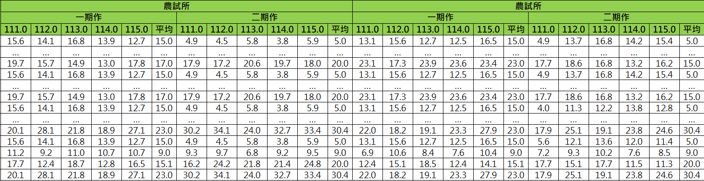

1.頁籤類別有[灌區資訊、埤塘資訊、水源資訊、作物資訊、感測資訊、影像資訊、位置資訊]要改為[小組資訊、埤塘資訊、河水堰資訊、灌溉資訊、水源資訊、作物資訊、感測資訊、影像資訊、位置資訊、監測資訊]
stn 彈窗顯示「小組資訊、水源資訊、作物資訊」；
branch 彈窗顯示「小組資訊、水源資訊、作物資訊」；
grp 彈窗顯示「小組資訊、水源資訊、作物資訊」；
pound 彈窗顯示「埤塘資訊、灌溉資訊、水源資訊、感測資訊、位置資訊」；
weir 彈窗顯示「河水堰資訊、灌溉資訊、影像資訊、位置資訊」
sensor 彈窗顯示「感測資訊、影像資訊、位置資訊」；
divwork 彈窗顯示「影像資訊、位置資訊、監測資訊」；

stn、branch 小組資訊    格式如下
    小組數: 53
    灌溉面積: 3621
    直灌小組數: 0
    直灌面積: 0 
    右下+ 點開顯示表格
    序號 名稱 灌溉面積 是否為直灌區
    1   光復圳1-1號池小組   否

grp 小組資訊    格式如下
    灌溉面積: 3621 (直灌區) => ()部分是直灌區時才顯示
    右下+ 點開顯示表格
    序號 名稱 灌溉面積 是否為直灌區
    1   光復圳1-1號池小組   否

埤塘資訊    格式如下
    資料時間: 115/05/15 16時
    最大蓄水量: 6.67萬噸
    有效蓄水量: 3.78萬噸
    蓄水率: 57%

河水堰資訊  格式如下
    取水方向: 左岸
    水系: 社子溪
    支線: - (無資料時顯示"-")=>這段文字不用顯示 是補充給你理解的文字
    水源: 社子溪

灌溉資訊 格式如下
    灌溉水利小組
        灌溉面積: 3621 (直灌區) => ()部分是直灌區時才顯示
    灌溉埤塘   
        埤塘數: 3 口
        最大蓄水量: 31.33 萬噸
        有效蓄水量: 10.31 萬噸
        蓄水率: 33 %

水源資訊 格式如下
    來自於渠道直灌
        渠道數: 3 
        右下+ 點開顯示表格
        序號 名稱
        1   光復圳
    來自於河水堰直灌
        河水堰數: 3
        右下+ 點開顯示表格
        序號 河水堰名稱 取水方向 水系 支線 水源
        1   社子溪02號河水堰    社子溪  -   社子溪
    來自於埤塘
        埤塘數: 65 口
        最大蓄水量: 911 萬噸
        有效蓄水量: 236 萬噸
        蓄水率: 26 %
        右下+ 點開顯示表格
        序號 名稱 資料時間 最大蓄水量 有效蓄水量 蓄水率
        1   光復圳1-1號池   115/05/15 16時  6.67    3.78    57

作物資訊 格式如下
    小組數: 53
    農地湛水面積: 2878
    農試所一期作: 1372
    農試所二期作: 1027
    農糧署一期作: 1054
    農糧署二期作: 1372
    右下+ 點開顯示表格
    

pound感測資訊 格式如下
    時間: 115/05/15 16時
    最大蓄水量: 6.67萬噸
    有效蓄水量: 3.78萬噸
    蓄水率: 57%

weir感測資訊 格式如下
    時間: 115/05/15 16時
    水位: 0.8m
    流量: 0.5cms

影像資訊 維持現狀

位置資訊 維持現狀

監測資訊 格式如下
    顯示這張圖片 https://ai.iatyu.nat.gov.tw/video/Image/03020202 每10秒刷新一次

