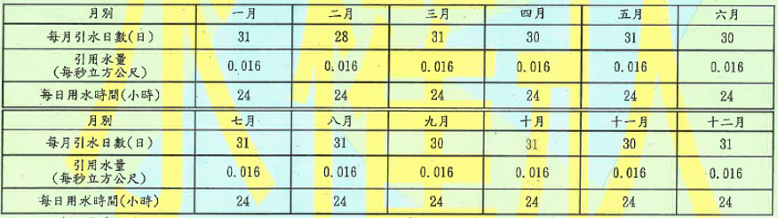

河水堰資訊

如果 水權狀號數!="" 或 !=null
格式如下:


取水方向:左岸
水系:社子溪
支線:-
水權狀態:有效水權
水權狀號數:H0110136
申請日期:民國113年6月20日
水權人姓名:農業部農田水利署桃園管理處
核准水權年限:自民國113年9月1日起至民國118年8月31號止
用水標的:農業用水
引用水源:社子溪水系社子溪支流
用水範圍:楊梅區下陰影窩段688地號等3088筆土地
使用方法:自然流方式引水
引水地點:桃園市楊梅區民豐段0065-0000地號
退水地點:
 (表格如圖)
水頭高度(水力用): - 公尺
水井深度(地下水用): - 公尺
登記主管機關:桃園市政府

如果 水權狀號數=="" 或 ==null
格式如下:

取水方向:左岸
水系:社子溪
支線:-
水權狀態:無水權，申請中

補充
資料為空的的時候 顯示"-"
detailOverrides.js 內的相關資料也幫我同步做修改，根據情況新增屬性或移除屬性，數值不正確沒關係，我再手動修改

建議
用水範圍除了顯示文字"楊梅區下陰影窩段688地號等3088筆土地" 後面會添加一個按鈕 彈窗顯示 arcGIS畫出該區域範圍
你可以幫我先做一個簡單的示意版本嗎

建議與規劃

1. 資料結構建議

河水堰資訊建議維持固定 schema，即使沒有資料也保留欄位，值使用 null，不要省略屬性，也不要在資料層放 "-":

```js
weir: {
  intakeDirection: "左岸",
  riverSystem: "社子溪",
  branchLine: null,
  waterSource: "社子溪",
  waterRightStatus: "有效水權",
  waterRightNumber: "H0110136",
  applicationDate: "2024-06-20",
  waterRightOwner: "農業部農田水利署桃園管理處",
  approvedWaterRightStartDate: "2024-09-01",
  approvedWaterRightEndDate: "2029-08-31",
  waterUsePurpose: "農業用水",
  referencedWaterSource: "社子溪水系社子溪支流",
  waterUseArea: "楊梅區下陰影窩段688地號等3088筆土地",
  waterUseMethod: "自然流方式引水",
  intakeLocation: "桃園市楊梅區民豐段0065-0000地號",
  returnWaterLocation: null,
  monthlyWaterUse: [],
  hydraulicHeadHeight: null,
  groundwaterWellDepth: null,
  registrationAuthority: "桃園市政府",
  waterUseAreaGeometry: null,
}
```

欄位顯示規則建議放在 component:

- null、undefined、空字串顯示為 "-"
- applicationDate 用西元日期儲存，畫面轉成民國年月日
- approvedWaterRightStartDate、approvedWaterRightEndDate 用西元日期儲存，畫面串成「自民國113年9月1日起至民國118年8月31號止」
- monthlyWaterUse 必須直接放在該筆 weir 資料內，不建議用 normalize 自動補預設資料

2. 退水地點下方月別用水表

目前表格應維持兩張獨立 table:

- 第一張顯示一月到六月
- 第二張顯示七月到十二月
- 每張 table 的列順序為: 月別、每月引水日數(日)、引用水量(每秒立方公尺)、每日用水時間(小時)

這樣比單一 table 用粗線分隔更容易閱讀，也比較接近附圖格式。

3. 用水範圍 ArcGIS 示意版建議

短期可以先做「示意版本」，不要一開始就串完整 ArcGIS 權限與圖層流程。建議資料新增:

```js
waterUseAreaGeometry: {
  type: "polygon",
  spatialReference: { wkid: 4326 },
  rings: [
    [
      [121.104, 24.946],
      [121.108, 24.946],
      [121.108, 24.949],
      [121.104, 24.949],
      [121.104, 24.946],
    ],
  ],
}
```

示意版互動:

- 「用水範圍」文字後方加一個「查看範圍」按鈕
- 點擊後開啟小彈窗
- 彈窗內先顯示一個簡化地圖容器
- 若還沒有 ArcGIS SDK，可先用靜態示意區塊或簡單 SVG polygon 呈現範圍
- 後續正式版再替換成 ArcGIS MapView

4. 正式 ArcGIS 版本規劃

正式串接時建議拆成獨立 component:

- WaterUseAreaButton.vue: 顯示「查看範圍」按鈕與控制彈窗開關
- WaterUseAreaMapDialog.vue: 彈窗框架
- ArcGisAreaMap.vue: 專門負責 ArcGIS MapView 初始化、圖層、geometry 顯示、縮放定位

資料來源建議後端提供其中一種:

- geometry: 直接回傳 polygon/multipolygon 座標
- featureId: 前端用 id 查 ArcGIS feature layer
- arcgisUrl + objectId: 前端根據服務 URL 與 objectId 取得圖徵

若正式環境會有大量地籍資料，建議優先用 featureId 或 objectId，不要把大型 polygon 全塞進 detail API。

5. 實作順序建議

第一階段:

- 保持目前河水堰資訊彈窗欄位
- 在 detailOverrides.js 補 waterUseAreaGeometry: null
- 在用水範圍後方加「查看範圍」按鈕
- 按鈕點擊後開啟簡單示意彈窗

第二階段:

- 將示意彈窗抽成獨立 component
- 用 mock polygon 畫出簡單範圍
- 確認手機與桌機彈窗尺寸、捲動與關閉行為

第三階段:

- 引入 ArcGIS SDK 或既有圖台工具
- 用正式 geometry / featureId 顯示範圍
- 加入 loading、查無範圍、ArcGIS 載入失敗等狀態

6. 需要注意的地方

- ArcGIS SDK 體積較大，若只在按鈕點擊後才需要地圖，建議用 dynamic import 延遲載入
- 地圖彈窗不要放在目前 detail-list 裡，避免表格與地圖互相擠壓
- waterUseArea 文字是水權資料描述，waterUseAreaGeometry 是地圖圖形資料，兩者應分開欄位
- 沒有範圍資料時，按鈕可以 disabled 或不顯示；正式規格需二選一固定
